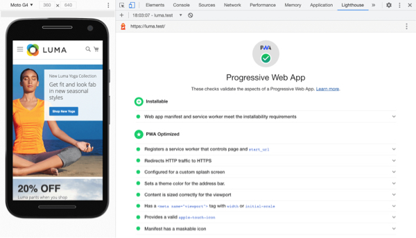
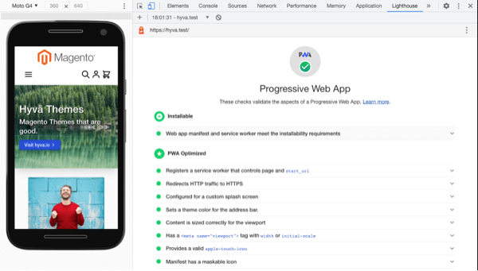
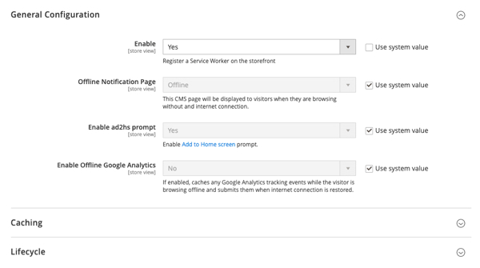

# Monsoon Service Worker

Adds icons, a web manifest file and service-worker file to make magento 2 a [PWA](https://web.dev/pwa-checklist/).

## Main Features
- Supports Magento Blank and Luma as well as [Hyvä] based themes.   
⚠️ *Hyvä* is recommended to ensure fast performance.   
   
   
- Makes Magento Installable as a PWA.
- A CMS Page can be configured for an offline page.
- [Add to Home screen prompt](https://developer.mozilla.org/en-US/docs/Web/Progressive_web_apps/Add_to_home_screen)
- Enable/Disable Offline Google Analytics.
- Utilises the Browser's [Cache API].
- Service worker lifecycle management.

## Installation
```shell
composer require monsoon/module-pwa
```

## Configuration
To configure the module go to _Stores > Configuration > Monsoon > PWA_.    


### Offline Page
In _Stores > Configuration > Monsoon > PWA_ select the page you wish to use as your offline notification page.   
Alternatively use the default one provided by this module.

## Customisation
In your Magento theme, override the images and PWA app details found in:
- Monsoon/Pwa/view/frontend/web/images/favicons
- Monsoon/Pwa/view/frontend/web/manifest.icon

For generating the correct icons you there are useful tools such as 
a [favicon generator](https://realfavicongenerator.net/) and [maskable icon editor](https://maskable.app/editor).

### Configure Service Worker
Most PWA features can be adjusted added in the service-worker file.    
Simply override `Monsoon_Pwa/view/frontend/templates/service-worker.js.phtml` in your theme to customise.

[Hyvä]: https://hyva.io/
[Cache API]:https://web.dev/cache-api-quick-guide/
